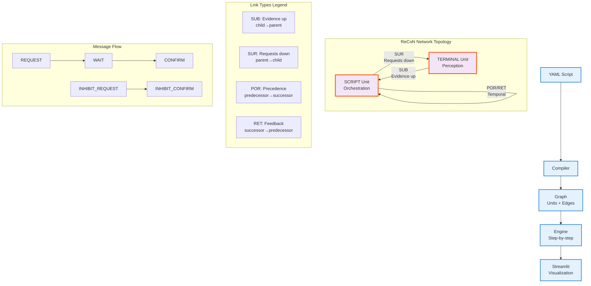

# Request Confirmation Networks: Active Perception Implementation and Dynamic Visualization

## Abstract

This project implements a faithful, practical Request Confirmation Network (ReCoN) based on the CoCoNIPS 2015 paper. ReCoN is modeled as a spreading-activation graph in which scripted units actively request evidence from terminal units and confirm hypotheses through hierarchical composition and temporal sequencing. The implementation includes a modular Python core, a YAML→graph compiler for authoring object scripts, a lightweight perception pipeline for synthetic scenes (houses, barns, occlusions), and an interactive Streamlit visualization. The result demonstrates end‑to‑end active perception: selective, top‑down computation with interpretable control flow and a clear bridge from representation to user interface.

## Demo & Links

- Project repository: <ADD_REPO_URL>
- Demo video (2–3 min): <ADD_VIDEO_LINK>
- Interactive demo (Streamlit): see Quickstart below to run locally
- Original paper: [CoCoNIPS 2015 PDF](CoCoNIPS_2015_paper_6.pdf)

## Quickstart (Reproduce in ~2 minutes)

```bash
python -m venv .venv
source .venv/bin/activate  # macOS/Linux
# .venv\Scripts\activate   # Windows

pip install -r requirements.txt

# Interactive visualization
streamlit run viz/app_streamlit.py

# CLI example: run a YAML script and print a snapshot
python scripts/recon_cli.py scripts/house.yaml --steps 5 --deterministic --ret-feedback

# Alternative: dump to a file
python scripts/recon_cli.py scripts/house.yaml --steps 10 --out snapshot.json

# Run comprehensive graph validation demo
python scripts/graph_validation_demo.py
```

## Problem Framing

Recognizing composite objects requires actively confirming parts and relations rather than passively classifying pixels. ReCoN's message-driven scripts express "what to look for next" and "when to stop," which is central to active perception. The scope focuses on controlled 2D synthetic scenes including houses, barns, and occlusions to clearly demonstrate hierarchical parts with AND/OR structure and ordered checks. Success criteria require that a top-level hypothesis (e.g., "house") drives selective SUR requests to relevant terminals, confirms parts in sequence, and yields a readable causal narrative in the UI.

## Approach Overview

ReCoN consists of SCRIPT and TERMINAL units that are tiny finite-state machines (INACTIVE, REQUESTED, WAITING, ACTIVE, TRUE, CONFIRMED, FAILED, SUPPRESSED) connected by typed links—SUB (evidence up), SUR (requests down), POR (temporal precedence), RET (temporal feedback)—and coordinate via REQUEST/CONFIRM/WAIT/INHIBIT messages. In active perception, scripts issue SUR requests only when needed; evidence flows upward via SUB; POR/RET impose ordering so predecessors unlock successors and failures feed back. The design features modular separation (graph, engine, compiler, perception, visualization), deterministic stepping for reproducibility, and a minimal YAML schema to author hierarchies and sequences compiled into graphs.

## System Architecture

- Core modules and responsibilities:
  - `recon_core/engine.py` — update cycle, compact gate arithmetic, message passing
  - `recon_core/graph.py` — `Unit`, `Edge`, `Graph` data structures + comprehensive validation
  - `recon_core/enums.py` — states, messages, link types, unit types
  - `recon_core/compiler.py` — YAML → graph (hierarchy via SUB/SUR; sequence via POR; RET optional)
  - `recon_core/metrics.py` — runtime stats and convenience helpers
  - `perception/dataset.py` — synthetic scenes (house, barn, occlusion, variations)
  - `perception/terminals.py` — terminal features (filters, SIFT-like, autoencoder)
  - `scripts/graph_validation_demo.py` — comprehensive validation demonstration
  - `viz/app_streamlit.py` — interactive visualization



End-to-end flow: a YAML script (e.g., `scripts/house.yaml`) is compiled into a `Graph` of `Unit`s and `Edge`s. The `Engine` advances in discrete steps—propagating activation by link type, processing messages, updating states with soft activation dynamics, and delivering messages asynchronously. The Streamlit app renders unit states and messages as the engine steps through a scene, exposing the causal chain of requests and confirmations.

## Implementation Details

- Compact gate arithmetic (typical contributions):
  - SUB: TRUE/CONFIRMED → +1.0; FAILED → −1.0
  - SUR: REQUESTED/ACTIVE → +0.3; FAILED → −0.3
  - POR: CONFIRMED → +0.5; FAILED → −0.5
  - RET: CONFIRMED → +0.2; FAILED → −0.5
- State machine semantics and message handling across the four-phase step.
- Engine configuration knobs (confirmation ratio, deterministic order, feedback).
- Script compilation from `scripts/*.yaml` into graph structure.
- Key engineering choices and trade-offs.

### Four-phase step

The ReCoN engine operates in discrete time steps with a carefully orchestrated four-phase algorithm that separates concerns and enables predictable, deterministic behavior. Each phase serves a distinct purpose in the spreading-activation dynamics:

**Phase 1 - Propagation**: For each link type (SUB, SUR, POR, RET), the engine evaluates "gate functions" that determine how much activation flows from source to destination units. For example, a CONFIRMED unit sends positive deltas (+0.5) through POR links to unlock successors, while a FAILED unit sends negative deltas (-0.5) through RET links to propagate failure backward. These deltas are summed by destination unit, creating a unified activation change signal.

**Phase 2 - State Update**: Messages are processed first (REQUEST boosts activation and may trigger REQUESTED state, CONFIRM provides additional activation boosts, WAIT forces WAITING state, inhibition messages reduce activation and can cause state transitions). Then activation levels are updated softly using the formula: `new_a = clamp(0, 1, old_a + gain * delta)`. Finally, state machines run - terminals become TRUE when requested and activation exceeds thresholds, scripts orchestrate children and manage sequences through POR/RET links.

**Phase 3 - Message Delivery**: All messages queued in unit outboxes during Phase 2 are transferred to recipient inboxes. This asynchronous mechanism prevents infinite loops and enables units to react to multiple simultaneous events.

**Phase 4 - Second Message Processing**: Any messages delivered in Phase 3 are immediately processed, allowing "within-step effects" where one unit's state change can immediately influence others in the same time step. This captures cascading effects like a terminal confirmation triggering a script confirmation that unlocks a successor.

### State semantics

The state semantics define how different unit types respond to activation and coordinate through the network:

**Terminal Units**: These leaf nodes interface with perception. They remain INACTIVE until receiving a REQUEST message, then transition to TRUE when their activation exceeds a threshold (default 0.1). Once TRUE, they send CONFIRM messages to parents via SUB links. If activation drops below a failure threshold, they transition to FAILED and send INHIBIT_CONFIRM messages. This models feature detection that requires both top-down attention (REQUEST) and bottom-up evidence.

**Script Units**: These orchestration nodes coordinate child activities. They become REQUESTED when activation exceeds a threshold, then ACTIVE where they send REQUEST messages to children via SUR links. They CONFIRM when a configurable ratio (default 0.6) of children are TRUE/CONFIRMED, implementing AND/OR logic through structural composition rather than explicit operators. Fail-fast behavior means any FAILED child immediately causes the script to FAIL and send INHIBIT_CONFIRM to parents.

**POR (Precedence) Links**: When a script CONFIRMS, it sends REQUEST messages through POR links to successor units, enforcing temporal ordering (e.g., detect roof before body before door). This creates sequential dependencies where predecessors must complete before successors activate.

**RET (Feedback) Links**: When successors FAIL, they send negative activation through RET links to demote CONFIRMED predecessors back to ACTIVE state (if ret_feedback_enabled=True). This allows failed later steps to restart earlier ones, modeling temporal dependencies where sequence violations require re-evaluation.

### Configuration

The `EngineConfig` class exposes behavioral knobs without changing core logic:

**Confirmation Ratio** (default 0.6): Controls how many children must be TRUE/CONFIRMED for a script to confirm. Higher values (→1.0) make confirmation more stringent, lower values (→0.0) make it more permissive. This enables exploring different AND/OR semantics - a ratio of 1.0 requires all children, 0.0 requires none.

**Deterministic Order** (default True): When enabled, units are processed in sorted ID order rather than dictionary iteration order. This ensures reproducible traces across runs, critical for debugging and pedagogy. When disabled, allows exploring non-deterministic behaviors.

**RET Feedback** (default False): Enables/disables temporal feedback where FAILED successors can demote CONFIRMED predecessors. When enabled, creates tighter temporal coupling where sequence failures propagate backward. When disabled, predecessors remain confirmed even if successors fail, modeling more independent subprocesses.

Additional knobs include gate strengths (sub_positive=1.0, por_positive=0.5, etc.), activation gain (0.8), and thresholds, allowing fine-tuning of network dynamics for different scenarios.

### Compiler

The YAML compiler translates declarative scripts into network topology:

**SUB/SUR Links**: Encode part-whole relationships. Every script-terminal pair gets bidirectional links: SUR (script→terminal) for top-down requests, SUB (terminal→script) for bottom-up evidence. Script-script hierarchies use the same pattern, creating trees where activation flows bidirectionally.

**POR Links**: Encode temporal sequences. A YAML `sequence: [roof, body, door]` creates POR edges (roof→body→door) for forward propagation. RET feedback is supported by the engine and can be added explicitly if desired; it is not auto-generated by the compiler.

**Structural Logic**: AND/OR relationships emerge from structure rather than explicit operators. A script with multiple children and confirmation_ratio=1.0 acts as AND (all required), while confirmation_ratio<1.0 acts as OR (some sufficient). Multiple weighted edges allow fine-grained control - a child with weight 2.0 counts as two confirmations.

**Auto-creation**: Missing terminals are created automatically, and the compiler handles both symbolic sequences ("roof then body") and direct child references, making scripts flexible yet structured.

### Trade-offs

The implementation prioritizes pedagogical value over optimization:

**Lightweight Perception**: Simple terminal features (filters, SIFT-like, geometric) run quickly without heavy computation. This favors responsiveness and understandability over accuracy, making the active perception paradigm clear through fast iteration rather than complex feature extraction.

**Deterministic Stepping**: Fixed four-phase algorithm with configurable deterministic ordering trades performance (could parallelize phases) for predictability. Every run produces identical traces, enabling step-by-step debugging and causal analysis - essential for understanding the algorithm but slower than optimized async execution.

**Readability Emphasis**: Clean separation (engine handles dynamics, graph handles structure, compiler handles authoring), comprehensive docstrings, and modular design prioritize maintainability. YAML scripts are declarative and human-readable, while Python code uses clear naming and single-responsibility functions.

**Testability Focus**: Extensive test suite covers edge cases, synthetic scenes enable controlled experimentation, and configuration knobs allow systematic parameter sweeps. This makes the system reliable and scientifically reproducible, though it adds complexity that pure performance implementations might avoid.

These design choices create a system that's easier to understand, debug, and extend than raw performance would allow, making it ideal for research and education while still demonstrating practical active perception capabilities.

## Differences vs Original Paper (What, Why, Benefit)

- **Four-phase update cycle**
  - What: Split the paper’s processing into Propagation → State Update → Message Delivery → Second Message Processing.
  - Why: Remove race conditions and make within-step causality explicit and deterministic.
  - Benefit: Reproducible traces and easier debugging; defensible 4-phase variant mapped to the paper’s single processing phase.

- **Deterministic iteration order**
  - What: Sorted processing of units/messages (configurable).
  - Why: Ensure identical behavior across runs/platforms.
  - Benefit: Stable demos/tests; clear, comparable experiments.

- **Declarative YAML → graph compiler**
  - What: Compile `scripts/*.yaml` into SUB/SUR hierarchies and POR/RET sequences.
  - Why: Separate authoring from execution; speed up iteration.
  - Benefit: Readable scripts, reuse of parts, quick scenario swaps (house/barn).

- **Configurable confirmation ratio and edge weights**
  - What: Parameterize AND/OR behavior via `confirmation_ratio` and weighted children.
  - Why: Explore structural logic without code changes.
  - Benefit: Flexible modeling; clearer ablations.

- **RET feedback toggle**
  - What: Option to let failed successors demote confirmed predecessors.
  - Why: Control temporal coupling strength.
  - Benefit: Compare strict vs. permissive sequencing behaviors.

- **Lightweight synthetic perception + optional autoencoder**
  - What: Simple filters/geometric features with optional denoising AE features.
  - Why: Prioritize clarity/speed over heavy CV.
  - Benefit: Real-time demos and interpretable evidence signals.

- **Metrics and instrumentation**
  - What: Request counts, first-step timings, convenience metrics.
  - Why: Quantify “active” efficiency and progress.
  - Benefit: Measurable improvements; easier analysis.

- **Comprehensive graph validation + health scoring**
  - What: Cycle, link-consistency, relationships, integrity, performance analysis.
  - Why: Prevent invalid graphs and surface bottlenecks.
  - Benefit: Robustness and actionable feedback during authoring.

- **GraphML export and Streamlit UI**
  - What: Export to external tools; interactive visualization of states/messages.
  - Why: Improve interpretability and presentation.
  - Benefit: Clear causal narratives for teaching, demos, and debugging.

- **CLI workflow and tests**
  - What: Reproducible CLI runs and a test suite.
  - Why: Reliability and CI friendliness.
  - Benefit: Confidence to extend/modify without regressions.

## Dataset & Terminals

- Synthetic scenes from `perception/dataset.py` (size, noise, occlusion, variations).
- Terminal features from `perception/terminals.py`:
  - Basic filters, SIFT-like features, blob/geometric features, optional autoencoder.
- Mapping from features to terminal units used in the demo(s).

Rationale: synthetic glyph-like scenes make object structure explicit (e.g., roof above body; door inside body), highlighting ReCoN's strengths in representing part relations and temporal checks. Terminals provide simple, explainable feature activations; an optional denoising autoencoder can supply compact learned features when enabled.

## Visualization & UX

- What the Streamlit app shows: graph states, message flow, scene overlays, step/run controls.
- How the visualization reveals causality (requests, confirmations, failures, sequencing).

The UI presents the network graph with nodes colored by state and animated message edges, alongside the current scene and overlays for detected terminals. Controls allow single-step, run/pause, and reset. This pairing makes it easy to see which requests were issued, which evidence arrived, and why a script confirmed or failed.

## Graph Validation System

The implementation includes a comprehensive graph validation system that ensures network integrity and performance:

### Validation Capabilities
- **Cycle Detection**: Identifies problematic cycles in SUB/SUR relationships that could cause infinite loops
- **Link Consistency**: Validates proper link type usage (SUB from terminals, POR between scripts, etc.)
- **Unit Relationships**: Ensures terminals and scripts follow proper hierarchical patterns
- **Activation Bounds**: Checks activation levels and thresholds are within valid ranges [0.0, 1.0]
- **Graph Integrity**: Detects orphaned units, connectivity issues, and structural problems
- **Performance Metrics**: Analyzes complexity, efficiency, and identifies bottlenecks
- **Health Scoring**: Overall graph quality assessment from 0.0 (unhealthy) to 1.0 (perfect)
- **Custom Validation**: Extensible framework for domain-specific validation rules

### Validation Demo
```bash
# Run comprehensive validation demonstration
python scripts/graph_validation_demo.py
```

This demo showcases the system detecting validation issues across multiple categories, including cycles, link consistency violations, unit relationship problems, activation bound errors, and graph integrity issues.

### Integration with Existing Workflow
```python
from recon_core.compiler import compile_from_file

# Compile and validate a ReCoN script
graph = compile_from_file('scripts/house.yaml')

# Quick validity check
if graph.is_valid():
    print("Graph structure is valid!")
else:
    print("Graph has validation issues")

# Get comprehensive statistics
stats = graph.get_graph_statistics()
print(f"Health score: {stats['health_score']:.3f}")
print(f"Validation issues: {stats['validation_summary']['total_issues']}")
```

## Experiments & Results

- Qualitative traces: step-by-step sequences on house and barn scenes showing selective SUR requests, confirmations via SUB, and POR-driven sequencing (e.g., roof → body → door).
- Stressors: occlusion and added noise to illustrate failure cases and how inhibition/ordering affect behavior.
- Toggles: with/without POR; different confirmation ratios; deterministic vs. nondeterministic ordering.
- Validation testing: Comprehensive validation system tested with intentionally problematic graphs, successfully detecting all categories of structural issues.

## Evaluation vs. CIMC Criteria

- Implemented a novel theoretical idea → faithful ReCoN with tests and docs.
- Translation between representation and UI → interactive visualization + CLI.
- Active perception exhibited → selective terminal requests, temporal sequencing.
- Bonus (if applicable) → learning utilities, format conversion, metrics suite, comprehensive graph validation system with cycle detection, performance monitoring, and health scoring.

## Limitations & Future Work

- Current constraints (noise robustness, scaling, learned structure), and practical limitations.
- Next steps: richer perception (CNNs), learning SUB/SUR/POR/RET, multi-modal, real-time.

## How to Run Tests

```bash
python -m pytest tests/ -v
# Lightweight runner if pytest unavailable
python run_tests.py
```

## Configuration Reference

Typical engine configuration usage:

```python
from recon_core.config import EngineConfig
from recon_core.engine import Engine

cfg = EngineConfig(
    sur_positive=0.3,
    por_positive=0.5,
    confirmation_ratio=0.6,
    deterministic_order=True,
    ret_feedback_enabled=False,
)
engine = Engine(graph, config=cfg)
```

- Env flags: `RECON_TRAIN_AE=1` enables autoencoder training for terminals.

## Submission Artifacts

- Source code, `requirements.txt`, and this `SUBMISSION.md`.
- Demo video link and a few screenshots from the Streamlit UI.
- Example YAML scripts in `scripts/` (e.g., `house.yaml`, `barn.yaml`).
- Reproducibility notes (Python version, OS; no GPU required).

## Acknowledgements

- "Request Confirmation Networks for Active Object Recognition" (CoCoNIPS 2015). See `CoCoNIPS_2015_paper_6.pdf`.
- Libraries and tools used (Streamlit, NumPy, etc.).
