# Request Confirmation Networks: Active Perception Implementation and Dynamic Visualization

## Abstract

This project implements a faithful, practical Request Confirmation Network (ReCoN) based on the CoCoNIPS 2015 paper. ReCoN is modeled as a spreading-activation graph in which scripted units actively request evidence from terminal units and confirm hypotheses through hierarchical composition and temporal sequencing. The implementation includes a modular Python core, a YAML→graph compiler for authoring object scripts, a lightweight perception pipeline for synthetic scenes (houses, barns, occlusions), and an interactive Streamlit visualization. The result demonstrates end‑to‑end active perception: selective, top‑down computation with interpretable control flow and a clear bridge from representation to user interface.

## Demo & Links

- **Github Repo**: https://github.com/csmangum/ReCoN  
- **Detailed Documentation**: https://github.com/csmangum/ReCoN/blob/main/RECON_DOCUMENTATION.md
- **Root Activation Animation**: [RootActivationScene.mp4](RootActivationScene.mp4) - Visual demonstration of spreading activation dynamics
- **Simple User Interface**: See Quickstart below to run locally or go [here](https://ktrk6tezeey9ssg6kuyplb.streamlit.app/). It's not fully validated, so some behavior may be incorrect.
- **Key Features Notebook**: [ReCoN_Key_Features_Demo.ipynb](ReCoN_Key_Features_Demo.ipynb) - Comprehensive demonstration of active perception, hierarchical recognition, temporal sequencing, and metrics
- **Original paper**: [CoCoNIPS 2015 PDF](CoCoNIPS_2015_paper_6.pdf)

## Quickstart (Reproduce in ~2 minutes)

```bash
python -m venv .venv
source .venv/bin/activate  # macOS/Linux
# .venv\Scripts\activate   # Windows

pip install -r requirements.txt

# Interactive visualization
streamlit run viz/app_streamlit.py

# CLI example: run a YAML script and print a snapshot
python3 scripts/recon_cli.py scripts/house.yaml --steps 5 --deterministic --ret-feedback

# Alternative: dump to a file
python3 scripts/recon_cli.py scripts/house.yaml --steps 10 --out snapshot.json

# Run comprehensive graph validation demo
python3 scripts/graph_validation_demo.py
```

## Problem Framing

Recognizing composite objects requires actively confirming parts and relations rather than passively classifying pixels. ReCoN's message-driven scripts express "what to look for next" and "when to stop," which is central to active perception. The scope focuses on controlled 2D synthetic scenes including houses, barns, and occlusions to clearly demonstrate hierarchical parts with AND/OR structure and ordered checks. Success criteria require that a top-level hypothesis (e.g., "house") drives selective SUR requests to relevant terminals, confirms parts in sequence, and yields a readable causal narrative in the UI.

## Approach Overview

ReCoN consists of SCRIPT and TERMINAL units that are tiny finite-state machines (INACTIVE, REQUESTED, WAITING, ACTIVE, TRUE, CONFIRMED, FAILED, SUPPRESSED) connected by typed links—SUB (evidence up), SUR (requests down), POR (temporal precedence), RET (temporal feedback)—and coordinate via REQUEST/CONFIRM/WAIT/INHIBIT messages. In active perception, scripts issue SUR requests only when needed; evidence flows upward via SUB; POR/RET impose ordering so predecessors unlock successors and failures feed back. The design features modular separation (graph, engine, compiler, perception, visualization), deterministic stepping for reproducibility, and a minimal YAML schema to author hierarchies and sequences compiled into graphs.

## System Architecture

- Core modules and responsibilities:
  - `recon_core/engine.py` — update cycle, compact gate arithmetic, message passing
  - `recon_core/graph.py` — `Unit`, `Edge`, `Graph` data structures + comprehensive validation
  - `recon_core/enums.py` — states, messages, link types, unit types
  - `recon_core/config.py` — tunable EngineConfig defaults and policies
  - `recon_core/compiler.py` — YAML → graph (hierarchy via SUB/SUR; sequence via POR; RET optional)
  - `recon_core/metrics.py` — runtime stats and convenience helpers
  - `perception/dataset.py` — synthetic scenes (house, barn, occlusion, variations)
  - `perception/terminals.py` — terminal features (basic filters, SIFT-like, blob/geometric, autoencoder, optional TinyCNN, extra engineered)
  - `scripts/recon_cli.py` — CLI to compile YAML, run engine, dump snapshots
  - `scripts/graph_validation_demo.py` — comprehensive validation demonstration
  - `scripts/export_graphml_demo.py` — graph → GraphML export utility
  - `viz/app_streamlit.py` — interactive visualization

```mermaid
flowchart TD
    %% Main Pipeline
    YAML[YAML Script] --> Compiler[Compiler]
    Compiler --> Graph[Graph<br/>Units + Edges]
    Graph --> Engine[Engine<br/>Step-by-step]
    Engine --> Viz[Streamlit<br/>Visualization]

    %% Network Topology
    subgraph "ReCoN Network Topology"
        Script[SCRIPT Unit<br/>Orchestration]
        Terminal[TERMINAL Unit<br/>Perception]
    end

    %% Link Types
    Script -->|"SUR<br/>Requests down"| Terminal
    Terminal -->|"SUB<br/>Evidence up"| Script
    Script -->|"POR/RET<br/>Temporal"| Script

    %% Styling
    classDef pipeline fill:#E3F2FD,stroke:#1976D2,stroke-width:2px
    classDef network fill:#F3E5F5,stroke:#7B1FA2,stroke-width:2px
    classDef links stroke:#FF5722,stroke-width:3px

    class YAML,Compiler,Graph,Engine,Viz pipeline
    class Script,Terminal network
    class Script,Terminal links

    %% Legend
    subgraph "Link Types Legend"
        direction LR
        SUB_L[SUB: Evidence up<br/>child→parent]
        SUR_L[SUR: Requests down<br/>parent→child]
        POR_L[POR: Precedence<br/>predecessor→successor]
        RET_L[RET: Feedback<br/>successor→predecessor]
    end

    subgraph "Message Flow"
        direction LR
        REQUEST[REQUEST]
        WAIT[WAIT]
        CONFIRM[CONFIRM]
        REQUEST --> WAIT --> CONFIRM
        INHIBIT_R[INHIBIT_REQUEST] --> INHIBIT_C[INHIBIT_CONFIRM]
    end
```



End-to-end flow: a YAML script (e.g., `scripts/house.yaml`) is compiled into a `Graph` of `Unit`s and `Edge`s. The `Engine` advances in discrete steps—propagating activation by link type, processing messages, updating states with soft activation dynamics, and delivering messages asynchronously. The Streamlit app renders unit states and messages as the engine steps through a scene, exposing the causal chain of requests and confirmations.

## Implementation Details

- Compact gate arithmetic (configurable contributions; defaults):
  - SUB: TRUE/CONFIRMED → +1.0; FAILED → −1.0
  - SUR: REQUESTED/ACTIVE → +0.3; FAILED → −0.3
  - POR: CONFIRMED → +0.5; FAILED → −0.5
  - RET: CONFIRMED → +0.2; FAILED → −0.5
- State machine semantics and message handling across the four-phase step.
- Engine configuration knobs (confirmation ratio, deterministic order, feedback).
- Script compilation from `scripts/*.yaml` into graph structure.
- Key engineering choices and trade-offs.

### Four-phase step

The ReCoN engine operates in discrete time steps with a carefully orchestrated four-phase algorithm that separates concerns and enables predictable, deterministic behavior. Each phase serves a distinct purpose in the spreading-activation dynamics:

**Phase 1 - Propagation**: For each link type (SUB, SUR, POR, RET), the engine evaluates "gate functions" that determine how much activation flows from source to destination units. For example, a CONFIRMED unit sends positive deltas (+0.5) through POR links to unlock successors, while a FAILED unit sends negative deltas (-0.5) through RET links to propagate failure backward. These deltas are summed by destination unit, creating a unified activation change signal.

**Phase 2 - State Update**: Messages are processed first (REQUEST boosts activation and may trigger REQUESTED state, CONFIRM provides additional activation boosts, WAIT forces WAITING state, inhibition messages reduce activation and can cause state transitions). Then activation levels are updated softly using the formula: `new_a = clamp(0, 1, old_a + gain * delta)`. Finally, state machines run — terminals can become TRUE when activation exceeds thresholds (REQUEST helps but is not strictly required), scripts orchestrate children and manage sequences through POR/RET links.

**Phase 3 - Message Delivery**: All messages queued in unit outboxes during Phase 2 are transferred to recipient inboxes. This asynchronous mechanism prevents infinite loops and enables units to react to multiple simultaneous events.

**Phase 4 - Second Message Processing**: Any messages delivered in Phase 3 are immediately processed, allowing "within-step effects" where one unit's state change can immediately influence others in the same time step. This captures cascading effects like a terminal confirmation triggering a script confirmation that unlocks a successor via POR requests.

### State semantics

The state semantics define how different unit types respond to activation and coordinate through the network:

**Terminal Units**: These leaf nodes interface with perception. They transition to TRUE when their activation exceeds a threshold (`u.thresh`, default 0.5) and then send CONFIRM messages to parents via SUB links. Receiving a REQUEST typically boosts activation and accelerates reaching threshold, but a prior REQUEST is not strictly required by the engine. If activation later drops below a failure threshold (default 0.1), they transition to FAILED and send INHIBIT_CONFIRM messages. This models feature detection that benefits from top-down attention (REQUEST) while still allowing bottom-up evidence to confirm.

**Script Units**: These orchestration nodes coordinate child activities. They become REQUESTED when activation exceeds a threshold, then ACTIVE where they send REQUEST messages to children via SUR links. They CONFIRM when a configurable ratio (default 0.6) of children are TRUE/CONFIRMED, implementing AND/OR logic through structural composition rather than explicit operators. Fail-fast behavior means any FAILED child immediately causes the script to FAIL and send INHIBIT_CONFIRM to parents.

**POR (Precedence) Links**: When a script CONFIRMS, it sends REQUEST messages through POR links to successor units, enforcing temporal ordering (e.g., detect roof before body before door). This creates sequential dependencies where predecessors must complete before successors activate.

**RET (Feedback) Links**: When successors FAIL, they send negative activation through RET links to demote CONFIRMED predecessors back to ACTIVE state (if ret_feedback_enabled=True). This allows failed later steps to restart earlier ones, modeling temporal dependencies where sequence violations require re-evaluation.

### Configuration

The `EngineConfig` class exposes behavioral knobs without changing core logic:

**Confirmation Ratio** (default 0.6): Controls how many children must be TRUE/CONFIRMED for a script to confirm. The implementation computes `need = max(1, int(confirmation_ratio * num_children))` when there are children, so at least 1 child is always required if a script has any children. Higher values (→1.0) approach an "all children" requirement; lower values reduce the required count but never below 1 when children exist.

**Deterministic Order** (default True): When enabled, units are processed in sorted ID order rather than dictionary iteration order. This ensures reproducible traces across runs, critical for debugging and pedagogy. When disabled, allows exploring non-deterministic behaviors.

**RET Feedback** (default False): Enables/disables temporal feedback where FAILED successors can demote CONFIRMED predecessors. When enabled, creates tighter temporal coupling where sequence failures propagate backward. When disabled, predecessors remain confirmed even if successors fail, modeling more independent subprocesses.

Additional knobs include gate strengths (sub_positive=1.0, sur_positive=0.3, por_positive=0.5, ret_positive=0.2 with corresponding negatives), activation gain (0.8), thresholds (script_request_activation_threshold=0.1, terminal_failure_threshold=0.1, confirmation_ratio=0.6), and optional per-link minimal source activation thresholds (`*_min_source_activation`) to suppress propagation when the source activation is too low.

### Compiler

The YAML compiler translates declarative scripts into network topology:

**SUB/SUR Links**: Encode part-whole relationships. Every script-terminal pair gets bidirectional links: SUR (script→terminal) for top-down requests, SUB (terminal→script) for bottom-up evidence. Script-script hierarchies use the same pattern, creating trees where activation flows bidirectionally.

**POR Links**: Encode temporal sequences. A YAML `sequence: [roof, body, door]` creates POR edges (roof→body→door) for forward propagation. RET feedback is supported by the engine and can be added explicitly if desired; it is not auto-generated by the compiler.

**Structural Logic**: AND/OR relationships emerge from structure rather than explicit operators. A script with multiple children and confirmation_ratio≈1.0 behaves like AND (all required), while lower ratios behave more like OR (some sufficient). Edge weights do not change the child-count criterion for confirmation; confirmation uses counts of children in TRUE/CONFIRMED states.

**Auto-creation**: Missing terminals are created automatically, and the compiler handles both symbolic sequences ("roof then body") and direct child references, making scripts flexible yet structured.

### Trade-offs

The implementation prioritizes pedagogical value over optimization, with several key design decisions that represent trade-offs between different goals:

**Four-phase Update Cycle vs. Performance**
- **Choice**: Split the paper's single processing phase into Propagation → State Update → Message Delivery → Second Message Processing
- **Trade-off**: Deterministic, race-condition-free execution vs. potential performance overhead
- **Benefit**: Reproducible traces and easier debugging; defensible 4-phase variant mapped to the paper's single processing phase
- **Cost**: More complex execution model than the original paper's approach

**Deterministic vs. Non-deterministic Processing**
- **Choice**: Sorted processing of units/messages (configurable) vs. natural iteration order
- **Trade-off**: Reproducibility and stability vs. potential performance and natural randomness
- **Benefit**: Stable demos/tests; clear, comparable experiments across runs/platforms
- **Cost**: May not reflect real-world non-deterministic scenarios

**Declarative YAML Compiler vs. Direct Programming**
- **Choice**: Compile `scripts/*.yaml` into SUB/SUR hierarchies and POR/RET sequences vs. programmatic graph construction
- **Trade-off**: Authoring flexibility and readability vs. compilation overhead and learning curve
- **Benefit**: Readable scripts, reuse of parts, quick scenario swaps (house/barn)
- **Cost**: Additional abstraction layer and YAML schema complexity

**Configurable Parameters vs. Fixed Behavior**
- **Choice**: Parameterize AND/OR behavior via `confirmation_ratio` vs. hardcoded logic
- **Trade-off**: Flexibility and experimentation vs. complexity and potential confusion
- **Benefit**: Flexible modeling; clearer ablations without code changes
- **Cost**: More configuration options to understand and tune

**RET Feedback Toggle vs. Fixed Temporal Coupling**
- **Choice**: Option to let failed successors demote confirmed predecessors vs. fixed temporal behavior
- **Trade-off**: Configurable temporal coupling strength vs. additional complexity
- **Benefit**: Compare strict vs. permissive sequencing behaviors
- **Cost**: More behavioral modes to test and understand

**Lightweight Perception vs. Heavy Computer Vision**
- **Choice**: Simple filters/geometric features with optional autoencoder vs. state-of-the-art CV models
- **Trade-off**: Clarity, speed, and interpretability vs. accuracy and realism
- **Benefit**: Real-time demos and interpretable evidence signals
- **Cost**: May not generalize to complex real-world scenes

**Comprehensive Instrumentation vs. Minimal Overhead**
- **Choice**: Request counts, first-step timings, convenience metrics vs. minimal runtime overhead
- **Trade-off**: Measurable improvements and analysis capability vs. performance cost
- **Benefit**: Quantifiable "active" efficiency and progress; easier analysis
- **Cost**: Additional computation and memory overhead

**Extensive Validation vs. Trust and Simplicity**
- **Choice**: Cycle detection, link-consistency, relationships, integrity, performance analysis vs. minimal validation
- **Trade-off**: Robustness and actionable feedback vs. additional complexity and runtime cost
- **Benefit**: Robustness and actionable feedback during authoring
- **Cost**: More complex validation logic and potential false positives

**Interactive Visualization vs. Static Output**
- **Choice**: GraphML export and Streamlit UI vs. simple text output or logging
- **Trade-off**: Interpretability and presentation vs. development and maintenance overhead
- **Benefit**: Clear causal narratives for teaching, demos, and debugging
- **Cost**: Additional dependencies and UI complexity

**Comprehensive Testing vs. Development Speed**
- **Choice**: Reproducible CLI runs and extensive test suite vs. minimal testing
- **Trade-off**: Reliability and CI friendliness vs. development and maintenance overhead
- **Benefit**: Confidence to extend/modify without regressions
- **Cost**: More test code to maintain and potential over-testing

**Readability Emphasis**: Clean separation (engine handles dynamics, graph handles structure, compiler handles authoring), comprehensive docstrings, and modular design prioritize maintainability. YAML scripts are declarative and human-readable, while Python code uses clear naming and single-responsibility functions.

These design choices create a system that's easier to understand, debug, and extend than raw performance would allow, making it ideal for research and education while still demonstrating practical active perception capabilities.


## Dataset & Terminals

- Synthetic scenes from `perception/dataset.py` (size, noise, occlusion, variations).
- Terminal features from `perception/terminals.py`:
  - Basic filters, SIFT-like features, blob/geometric features
  - Optional denoising autoencoder terminals (`t_ae_*`) and TinyCNN terminals (`t_cnn_*`)
  - Extra engineered terminals: `t_vsym`, `t_line_aniso`, `t_triangle`, `t_rect`, `t_door_bright`
- Mapping from features to terminal units used in the demo(s).

Rationale: synthetic glyph-like scenes make object structure explicit (e.g., roof above body; door inside body), highlighting ReCoN's strengths in representing part relations and temporal checks. Terminals provide simple, explainable feature activations; an optional denoising autoencoder can supply compact learned features when enabled.

## Graph Validation System

The implementation includes a comprehensive graph validation system that ensures network integrity and performance:

### Validation Capabilities
- **Cycle Detection**: Identifies problematic cycles in SUB/SUR relationships that could cause infinite loops
- **Link Consistency**: Validates proper link type usage (SUB from terminals, POR between scripts, etc.)
- **Unit Relationships**: Ensures terminals and scripts follow proper hierarchical patterns
- **Activation Bounds**: Checks activation levels and thresholds are within valid ranges [0.0, 1.0]
- **Graph Integrity**: Detects orphaned units, connectivity issues, and structural problems
- **Performance Metrics**: Analyzes complexity, efficiency, and identifies bottlenecks
- **Health Scoring**: Overall graph quality assessment from 0.0 (unhealthy) to 1.0 (perfect)
- **Custom Validation**: Extensible framework for domain-specific validation rules

### Validation Demo
```bash
# Run comprehensive validation demonstration
python scripts/graph_validation_demo.py
```

This demo showcases the system detecting validation issues across multiple categories, including cycles, link consistency violations, unit relationship problems, activation bound errors, and graph integrity issues.

### Integration with Existing Workflow
```python
from recon_core.compiler import compile_from_file

# Compile and validate a ReCoN script
graph = compile_from_file('scripts/house.yaml')

# Quick validity check
if graph.is_valid():
    print("Graph structure is valid!")
else:
    print("Graph has validation issues")

# Get comprehensive statistics
stats = graph.get_graph_statistics()
print(f"Health score: {stats['health_score']:.3f}")
print(f"Validation issues: {stats['validation_summary']['total_issues']}")
```

### GraphML Export

Export any compiled or programmatically built graph for external analysis:

```python
from recon_core.compiler import compile_from_file

graph = compile_from_file('scripts/house.yaml')
graph.export_graphml('output/house_network.graphml')
```

## How to Run Tests

```bash
python -m pytest tests/ -v
# Lightweight runner if pytest unavailable
python run_tests.py
```

Selected tests include engine edge cases, compact arithmetic, graph structure, learning, metrics, and perception scenes. Use `make tests` if using the provided Makefile.

## Configuration Reference

Typical engine configuration usage:

```python
from recon_core.config import EngineConfig
from recon_core.engine import Engine

cfg = EngineConfig(
    sur_positive=0.25,
    por_positive=0.6,
    confirmation_ratio=0.7,
    deterministic_order=True,
    ret_feedback_enabled=True,
)
engine = Engine(graph, config=cfg)
```

- Env flags:
  - `RECON_TRAIN_AE=1` to enable autoencoder training; `RECON_TRAIN_AE_EPOCHS` to set epochs (default 30)
  - `RECON_TRAIN_CNN=1` to enable TinyCNN training; `RECON_TRAIN_CNN_EPOCHS` (default 10)
  - `RECON_MODEL_DIR` to set model cache directory (default `~/.cache/recon`)

